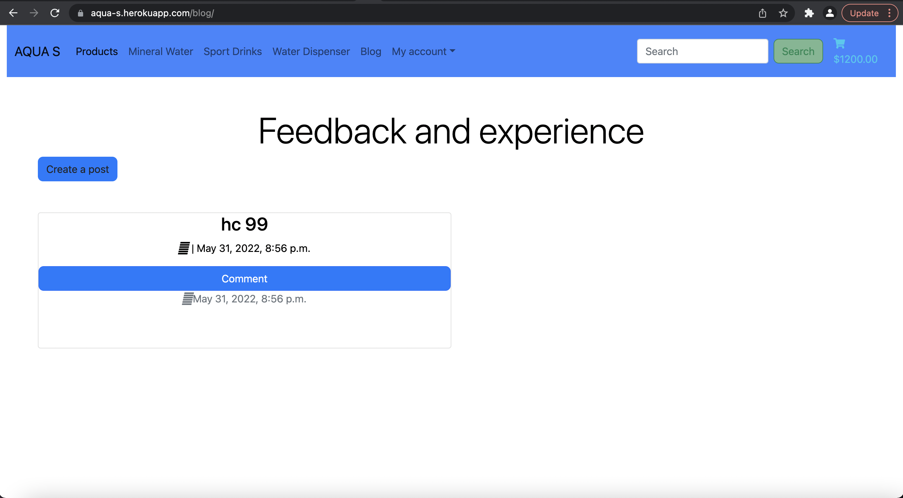

# AQUA_S

## Content

## 1. Introduction

## 2. UX

## 3. Features

## 4. Issues

## 5. Technologies

## 6. Testing

## 7. Deployment

## 8. Credits

# AUQA_S

Aqua_S is in e-commerce shop selling mineral water, sport drinks and water dispenser machines to private users or companies.

## UX

### User goals:

1. First time visitor: 

- an online shop what is easy to use and navigate around

- available products has informations about what are they and how to use

- easy and fast purchase option as a guest or a registered customer

- delivery options

2. Returning customer:

- a constantly maintained online shop wher the latest news and informations are always updated

- to be able to see purchase history

- to be able to reorder previous purchase

3. Creator goals:

- user friendly online shop

- informations about products

- easy transactions

- make the product available to customers who shop online

### Startegy:

1. Target audience:

- anyone who want to try healty mineral water

- new and returning customers

2. Demographics:

- age is not relevant

### Scope:

#### User requirements:

- shop with our without registration

- easy fast payment option

- home delivery when is available

- recieve confirmation about purchase

- e-commerce webshop where a wide selection is available

- account registration

- easy simple online payment

- blog post to contact with site admin

 post as admin

#### Admin requiremenets:

- add, edit or delete product

- offer machines for sale

- create a post where customers can ask qusetions regarding the products

- easy navigation through the entire webshop

- alert messages when adding, removing product from basket

### SEO documentation:

- ideas for short and long-tail keywords

- searching the keywords ideas on wordtracker 

after the search on wordtracker selected the following keywords to add as extra keywords to the meta selection:

- ion water

- ion water dispenser

- dissolved oxygen

- oxygen in water

### Structure:

Front page of Aqua_S

Products page, where all products visible

Mineral water section

Water dispenser section

My profile section

Basket, with added products

Blog section, where site admin post topics and customers can ask 

Create a post, site admin create the blog

### Skelton:

Balsamiq wireframe for windows and mobile screen:

- facebook business page

Opening of facebook Aqua_S, with key message next to logo

scroll down on the page

added pictures of the website background and logo

- mailchimp email subscribe option for visitors, customers

## Features:

## Issues:

## Technologies:

## Testing:

- During deploying i had manny issues with heroku, deployed, but bad request 400 error, than it was fixed, i had database loading errors too. In the end managed to fix that too with helps from tutors, but than categories not visible anymore when i want to upload item. The git version was working perfectly before the issues.

## Deployment:

## Credits: