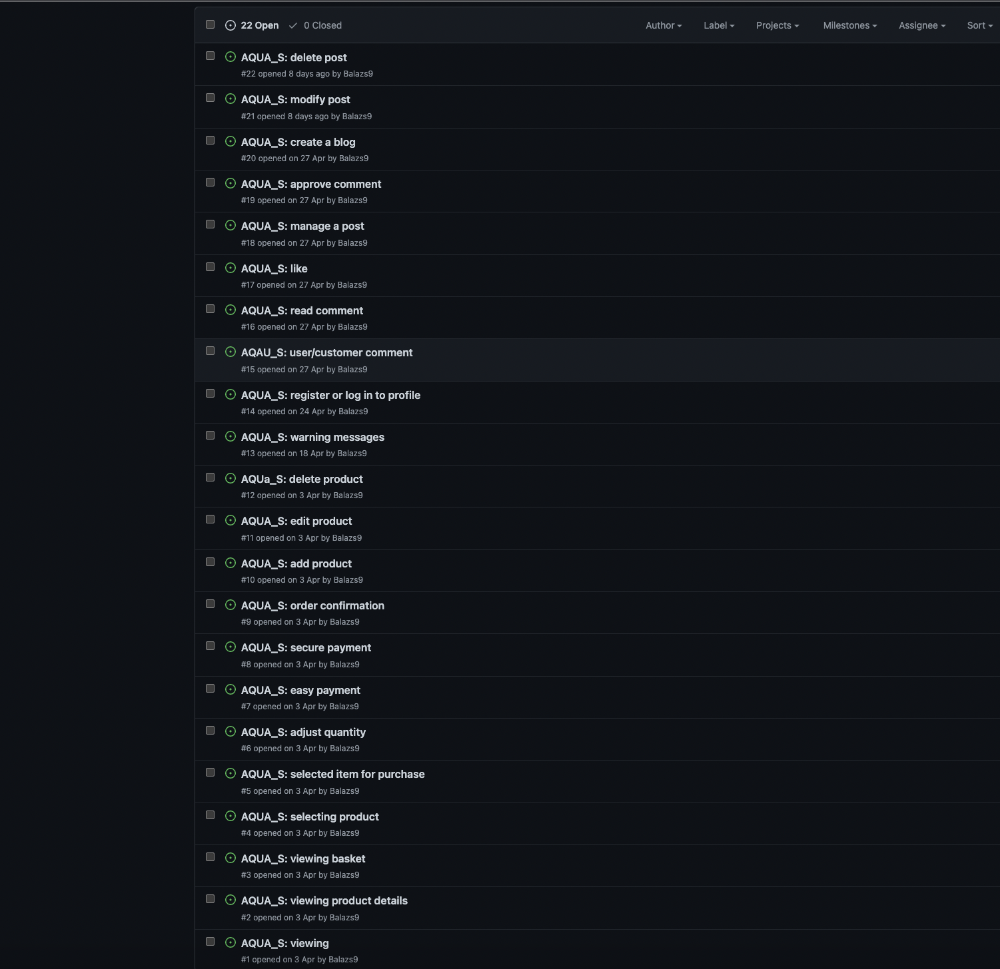
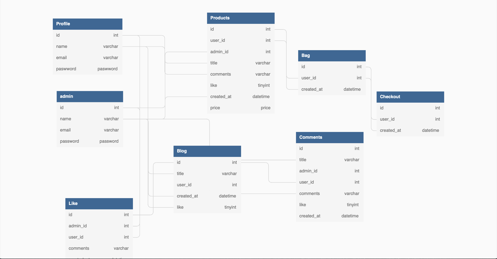
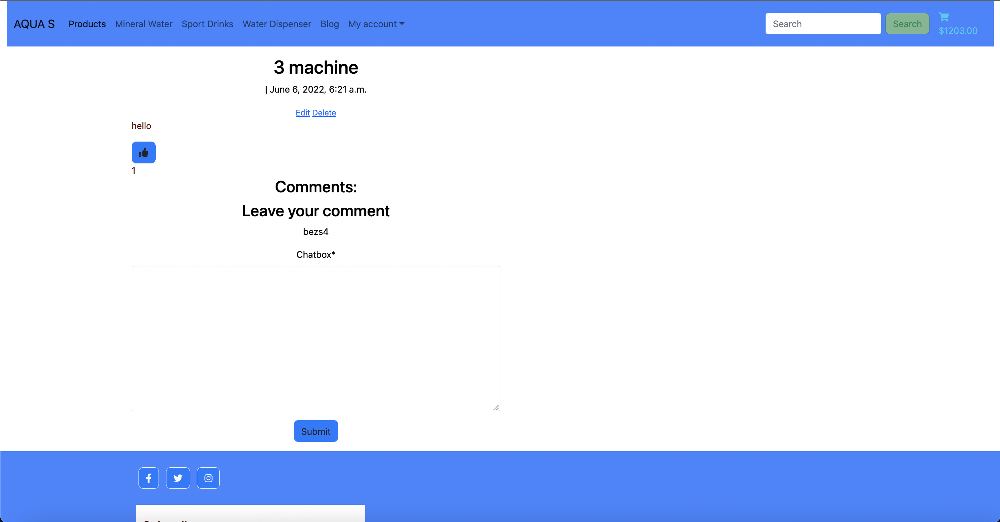
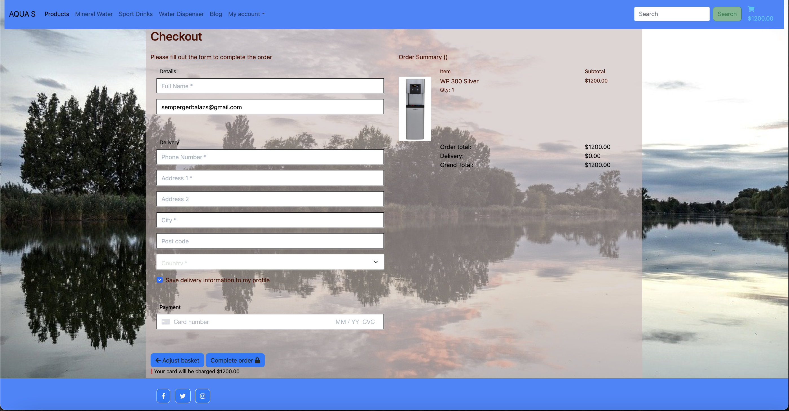
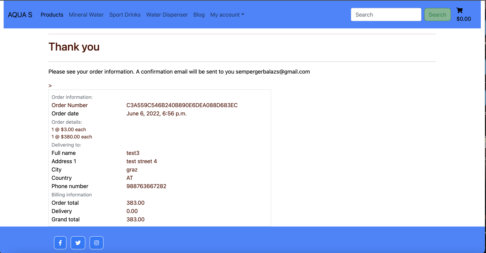
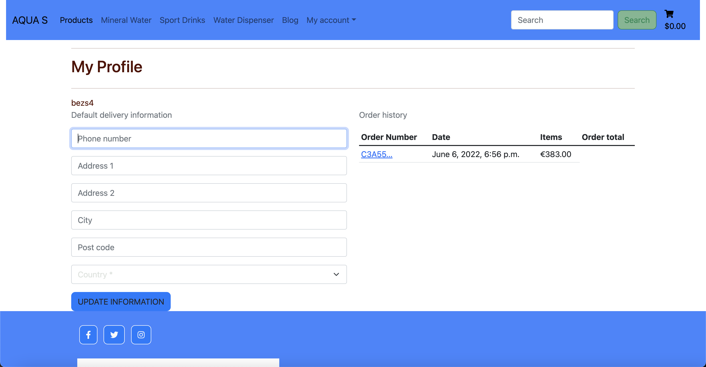
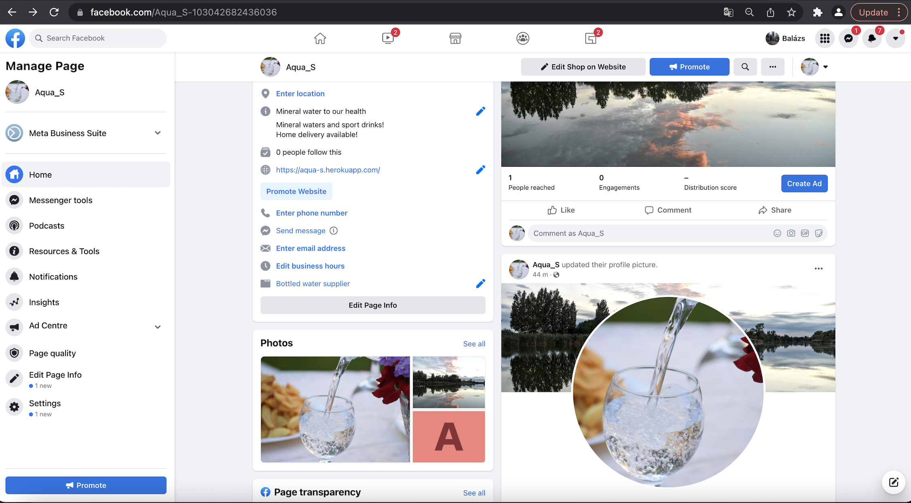
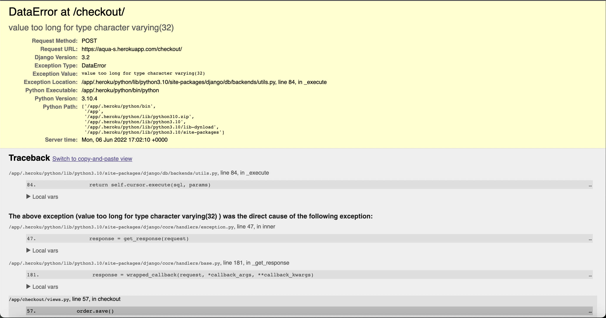
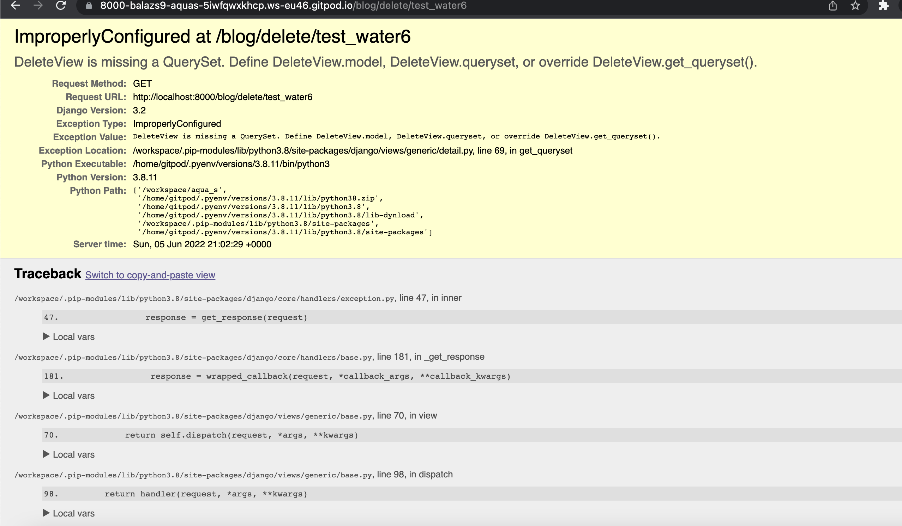

# AQUA_S

## Content

## 1. Introduction

## 2. UX

## 3. Features

## 4. Issues

## 5. Technologies

## 6. Testing

## 7. Deployment

## 8. Credits

# AUQA_S

Aqua_S is in e-commerce shop selling mineral water, sport drinks and water dispenser machines to private users or companies. The e commerce website made for a family business, where the goal is to reach more customers through the online shop. The blog page on the site makes it easier to customers to ask questions about the products or the service.
Customers can make their on blog where the site owner can comment on their question.

## User Stories

- user stories issues:

## UX

The build up of the webshop:

1. front page: opening, with a message about what is the shop about and a shop online button.

- mailchimp email subscribe service visible on all pages footer with the facebook link

2. navbar: containing all the pages which are producst, mineral water, sport drinks and water dispenser, blog and my account plus the shopping basket. From navbar customer/visitor can easily navigate through all pages back and forward.

3. Products page: is showing all the products on one page

4. mineral water, sport drinks and water dispenser pages showing only the relevant item what is supposed to be under these names.

5. blog: where site owner creating blog posts about products, services and customer ask questions, also they can create posts too and edit that.

6. my account: is about profile registrations, when logged in order history can be visited.

7. shopping basket: click on that goes to the bag app where customer can securely checkout make a simple payment.

### Design

I. Color scheme

- color selection: for the colors there is 2 main color what dominate through the whole website, white and blue, the blue is chosen because of the water. The main background is a picture of a riverside from a hungarian river.

### User goals:

1. First time visitor: 

- an online shop what is easy to use and navigate around

- available products has informations about what are they and how to use

- easy and fast purchase option as a guest or a registered customer

- delivery options

- easy navigation through the website

- create and comments post about products

2. Returning customer:

- a constantly maintained online shop wher the latest news and informations are always updated

- to be able to see purchase history

- to be able to reorder previous purchase

3. Creator goals:

- user friendly online shop

- informations about products

- easy transactions

- make the product available to customers who shop online

### Startegy:

1. Target audience:

- anyone who want to try healty mineral water

- new and returning customers

2. Demographics:

- age is not relevant

### Scope:

#### User requirements:

- shop with our without registration

- easy fast payment option

- home delivery when is available

- recieve confirmation about purchase

- e-commerce webshop where a wide selection is available

- account registration

- easy simple online payment

- blog post to contact with site admin

 post as admin

#### Admin requiremenets:

- add, edit or delete product

- offer machines for sale

- create a post where customers can ask qusetions regarding the products

- easy navigation through the entire webshop

- alert messages when adding, removing product from basket

### SEO documentation:

- ideas for short and long-tail keywords

- searching the keywords ideas on wordtracker 

after the search on wordtracker selected the following keywords to add as extra keywords to the meta selection:

- ion water

- ion water dispenser

- dissolved oxygen

- oxygen in water

### Structure:

DataBase Diagram

db diagram to show the build up and connections between the apps on the website

Admin Page models

Front page of Admin site

Categories of products on admin site

All products on admin site products model

Blog Feedback model on admin site

Create Post/blog on feedback model admin site

Front page of Aqua_S

Mailchimp email subscribe service for users to sign up 

Products page, where all products visible

Mineral water section

Water dispenser section

My profile section

Basket, with added products

Blog section, where site admin post topics and customers can ask 

Create a post, site admin create the blog

Comment on a blog post

Facebook link from footer to open

Checkout page with secure simple payment with stripe

Succesfull payment

Order history, what user can find under my account -> my account

### Skelton:

Balsamiq wireframe for windows and mobile screen:

- facebook business page

Opening of facebook Aqua_S, with key message next to logo

scroll down on the page

added pictures of the website background and logo

- mailchimp email subscribe option for visitors, customers, which is visible on every page

## Features:

- mailchimp email subscribe service

[mailchimp](https://mailchimp.com/?_ga=2.11213693.893351747.1654114279-1355780773.1654114279)

- features to be implement:

site owner to be able to delete the created post

## Issues:

## Technologies:

### Languages used:

- HTML5

- CSS

- PYTHON

- Javascript

### Libraries, frames used

- Django

Python based framework to develop the website

- Bootstrap5

To design the html

- Font awesome

To provide the used icons

- Google developer tools

To inspect and identify bugs than fix them

- AWS amazon webservice

to store media files

- SQLite

Database used localy

- PostgreSQL

Database used on heroku

- Balsamiq

Used to make the wireframe

- W3C html validator

Used to validate the html files

- W3C CSS validator

Used to validate css

- PEP8

Used to validate python code

- Crispy field

To manage django form

- Pixaby

Where the hero image found

## Testing:

- During deploying i had manny issues with heroku, deployed, but bad request 400 error, than it was fixed, i had database loading errors too. In the end managed to fix that too with helps from tutors, but than categories not visible anymore when i want to upload item. The git version was working perfectly before the issues.

- checkout error

after going through checkout app, checking models, views and templates, found some typing errors what caused this error message 'value too long'. The typing error was in models.py where () was missing from the end of the code. This error has been fixed and now customer can make a succesfull payment.

- in blog app delete view not working

- W3C html validator:

products templates: all passed

base template : passed

profiles template: passed

checkout templates: passed

bag templates: passed

- W3C CSS validator

base.css: 1 typing error found in line 198, fixed

checkout.css: passed

- PEP8 python validator

passed

## Deployment:

The project was deployed on Github and Heroku

- Git

Version control

- Github:

For storing the code and deploying

- Gitpod

Developing and building the site

- Heroku

To deploy the project

### Developing process:

1. create a new repositorie on github, using the code institue template

2. developing and editing the site on gitpod

3. Heroku: creating a new app

4. click create a new app

5. choose region

6. crate app

7. when is ready open the new app

8. go to resources -> Adds on -> add Heroku Postgres

9. go to settings

10. revael config war

add the following through during the development

- database url

- secret key

- email host pass

- email host user

- stripe public key

- stripe secret key

- aws keys

11. create procfile

12. settings add allowed_host

13. commit and push

14. push to heroku

- heroku login -i

heroku git:remote -a 'heroku app name'

git push heroku main

## Credits:

- Pixaby for the hero image

- my mentor 